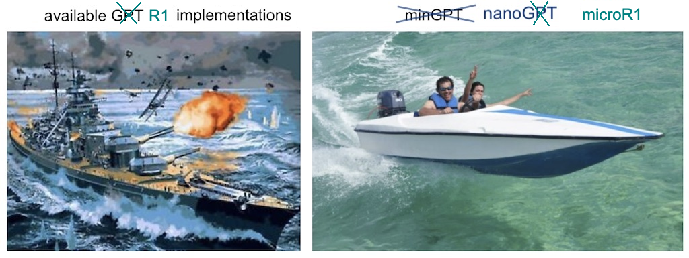

# microR1



A simple, fast repository for tuning (small) models using Group-Relative Policy Optimization (GRPO) with verified rewards - in the style of [DeepSeek-R1](https://arxiv.org/abs/2501.12948).

This repo was created in the image of Karpathy's lovely [nanoGPT](https://github.com/karpathy/nanoGPT) <3

Still under active development, but currently the file `train.py` will train `Qwen2.5-3B-Instruct` from ~20% up to 95% accuracy on a set of dynamically generated logic and math tasks, running on a single 8xA100 80GB node in about 3 hours (costs $44 = $1.79 / GPU / hr * 8 GPU * 3 hr at the time of writing). If you have a consumer GPU like a 4090, then with some minor tweaks to configs (see below) you can train `Qwen2.5-1.5B-Instruct` from ~0% up to 45% accuracy in about 16 hours.

The primary goal of microR1 is to be a fully featured, yet simple and hackable implementation of the post-training algorithm described in the Deepseek-R1. The code is meant to be plain and readable: `train.py` is a ~550-line GRPO training loop and `logicpuzzles.py` is a ~150-line set of task definitions. There are minimal dependencies or abstractions hiding crucial bits of logic. Language modeling is handled by `transformers` because it provides some important quality-of-life features such as kv-caching during response generation and gradient checkpointing during training. Additionally, since GRPO begins with a pre-trained model, using `transformers` gives access to a huge variety of starting points.

todo: reward chart, length chart

Because the code is simple and self-contained, it is very easy to hack to your needs. There are many useful and fully-featured RLHF libraries out there (see [TRL](https://github.com/huggingface/trl), [OpenRLHF](https://github.com/OpenRLHF/OpenRLHF), [verl](https://github.com/volcengine/verl)), but they tend to be difficult to parse for details on what is actually happening and difficult to modify. Some even have hard requirements on the usage of multiple GPUs.

Pull Requests welcome!

## install
```
pip install torch numpy transformers wandb
```
Dependencies:
- python >= 3.10
- [pytorch](https://pytorch.org/) <3
- [numpy](https://numpy.org/install/) <3
- [transformers](https://github.com/huggingface/transformers) for huggingface transformers <3 (to load pretrained models and provide generation + gradient checkpointing utilities)
- `wandb` for optional logging <3


## train a micro R1 model!

### I have a GPU
Great, if you have an 8xA100 (40GB) node then you can simply train `Qwen-2.5-3B-Instruct` using the default config settings:
```
torchrun --standalone --nproc_per_node=8 train.py
```

If you have a single 24GB consumer GPU, such as a 3090 or 4090, you can launch training of `Qwen-2.5-1.5B-Instruct` with the following command:
```
python train.py config/train_4090.py
```

If you have a GPU with less memory than a 4090, try sizing down the model. For example, you could train with `Qwen-2.5-0.5B-Instruct` using the following command:
```
python train.py config/train_4090.py --checkpoint_path="Qwen-2.5-0.5B-Instruct"
```

### I'm willing to rent a GPU
There is a tool included to launch train.py on [Modal](https://modal.com/), a serverless GPU provider. The following command will launch training of `Qwen-2.5-3B-Instruct` on an 8xA100 node, and should cost ~$60 on the first run (takes a while to download the model for the first time), and $40-50 on subsequent runs.

```bash
pip install modal
modal run --detach infra/run_on_modal.py --command "torchrun --standalone --nproc_per_node=8 train.py config/train_a100.py"
```

## logic puzzles
R1 models in this repo are trained on a set of logic puzzles and games: countdown, nim, and the Josephus problem. Here are some examples of each.

#### countdown:
The countdown problem has recently been used as a task in several recent small-scale R1 replications, such as [TinyZero](https://github.com/Jiayi-Pan/TinyZero). It is a search problem where a target number must be computed using a combination of provided operands and operators.
```
system
Respond in the following format: <think> ... </think> <answer> ... </answer>
user
Create an equation using only the numbers [38, 80, 96, 47] that equals 69. Use each number once with +, -, *, or /. Do not include an equals sign in the answer.
assistant
...
```

#### linear equation solving:
A simple task where the llm is asked to solve for `x`, given an equation like `3x + 6 = 21`.
```
system
Respond in the following format: <think> ... </think> <answer> ... </answer>
user
Solve for x in the equation: 3x + 6 = 21
Answer with just the number (the value of x).
assistant
...
```

#### single pile nim:
A two player strategy game where players take turns taking stones from a pile. The winner is the player who avoids taking the last stone. In single pile nim, the optimal strategy for the player who moves first is to take a number of stones such that the remaining stones are a multiple of (max_pickup + 1). For example, with max_pickup=3, you want to leave 4, 8, 12, etc. stones for your opponent. This forces them into a losing position.
```
system
Respond in the following format: <think> ... </think> <answer> ... </answer>
user
In Nim with 30 stones, taking between 1 and 3 per turn, what is the optimal number of stones you should take when moving first? Answer with a number.
assistant
...
```

#### josephus Problem:
The Josephus problem involves n people in a circle where every kth person is eliminated until one remains. The task is to find the safe position to stand in. For example, with n=5 people and k=2 (eliminating every 2nd person), position 3 survives.
```
system
Respond in the following format: <think> ... </think> <answer> ... </answer>
user
Josephus problem: In a circle of 16 people numbered 1 through 16, every 3rd person is eliminated in order until only one person remains. Which position should you stand in to be the last remaining person? Answer with a number.
assistant
...
```

#### byo logic puzzle or dataset!
You can add your own logic puzzle by simply implementing a make function in `logicpuzzles.py` and adding it to `default_tasks`.
```python
def make_single_pile_nim_example():
    """Create an example for single-pile Nim game task."""
    pile = randint(5, 50)
    pickup = randint(3, 5)
    optimal_move = min(pickup, pile % (pickup + 1) or pickup)

    prompt = f"In Nim with {pile} stones, taking between 1 and {pickup} per turn, what is the optimal number of stones you should take when moving first? Answer with a number."
    messages = make_messages(prompt)  # convert messages to a chat format

    def evaluate_nim_solution(solution, optimal_move):
        return str(optimal_move) == solution.strip()

    eval_fn = partial(evaluate_nim_solution, optimal_move=optimal_move)
    return messages, eval_fn
```

Make functions return a set of `messages` that pose a question to the LLM, and an `eval_fn` that takes the LLM's `solution` (the text within `<answer> ... </answer>` tags) and checks it for correctness.


## r1-zero vs r1
In the DeepSeek-r1 paper, they describe two models, DeepSeek-R1-Zero and DeepSeek-R1. To be technically accurate, `DeepSeek-R1-Zero` is trained via GRPO with verified rewards starting from a raw base model. That is, a model that has been pre-trained but has not been fine-tuned with SFT or RLHF.

`DeepSeek-R1` is similar, but one major difference is that the base model is tuned on a curated dataset of chain-of-thought reasoing examples before GRPO is started. This helps the model at the beginning of RL training.

When using a starting checkpoint such as `Qwen-2.5-30B-Instruct` (as is the default in this repository) we are more closely following the R1 recipie than the R1-Zero recipie. To train a model like R1-Zero, pass an argument like `--checkpoint_path="Qwen-2.5-30B"`

## implementation details / features
PPO and GRPO have a lot of implementation details, and the first question that many professionals would have looking at an implementation is: "Is this actually a correct / detailed implementation?". Here is the list of features that deserve a specific callout:
1. Rollout Phase / Learning Phase: A batch of episodes are generated from the policy model, and then batch SGD is used to learn from those episodes (as opposed to one group being generated and then one learning update being applied).
2. Adaptive KL Controller: Ported from OpenAI's PPO implementation. The KL divergence between the policy and reference model is adaptively controlled during training. If the KL divergence is too high, the KL penalty coefficient is increased to discourage large policy updates. If the KL divergence is too low, the coefficient is decreased to allow more exploration. This helps maintain a good balance between policy improvement and stability.
3. Reference Model Updating: Every `n` epochs, the reference model is re-initialized with the weights of the policy model.
4. VRAM Management: Measures are taken to reduce peak GPU memory usage. Gradient checkpointing, efficient logprob computation, reference model offloading to CPU, and more.
5. Logging / Monitoring: Important training diagnostics such as `learning/policy/clipfrac`, `learning/policy/kl_old`, `learning/policy/kl_ref`, `tokens/response_len_mean`, `env/acc_reward_mean`, and `env/format_reward_mean` are computed and logged.
6. Learning rate scheduling: Many PPO implementations use a linear decay learning rate schedule, which is implemented and enabled by default for microR1.

Notably absent features:
1. Separate devices/servers for Rollout phase. GRPO with LLMs is bottlenecked by the Rollout phase. In practice, an efficient inference server such as `vLLM` would be deployed on a separate device or fleet of devices to pump out completions. Then those completions would be moved to a device for the actual learning updates. This allows for more compute to be allocated to the Rollout phase, and for some overlap to occur between the Rollout phase and the Learning phase. In microR1, where one of the goals is simplicity / hackability, we do not do this, instead staying within a framework where both Rollout and Learning occur on the same device.

## baselines
TODO


## efficiency notes
Much of the time spent in `train.py` is spent generating completions in the rollout phase. If you are looking to optimize training time, keep [Ahmdal's law](https://en.wikipedia.org/wiki/Amdahl%27s_law) in mind and start here.

Peak memory consumption occurs during the learning phase, where activations, gradients, and optimizer states are kept in memory. If you are looking to fit a larger model onto your hardware, you should work to optimize this phase.


## todo
* Implement a task + evaluation for [gsm8k](https://huggingface.co/datasets/openai/gsm8k)
* Leverage an efficient inference server such as vLLM or SGLang
* More hyperparameter tuning, defaults are probably just okay
* Incorporate additional strategies such as advantage whitening
* Gradient accumulation in the learning phase
* Try out FSDP to fit larger models
* Consider adding a dependency on Peft


## citation
```bibtex
@misc{microR1,
author       = {Tyler Romero},
title        = {microR1},
year         = {2025},
publisher    = {GitHub},
journal      = {GitHub repository},
howpublished = {\url{https://github.com/tyler-romero/microR1}}
}
```

## references
Guo, Daya, et al. "Deepseek-r1: Incentivizing reasoning capability in llms via reinforcement learning." arXiv preprint [arXiv:2501.12948](https://arxiv.org/abs/2501.12948) (2025).

Shao, Zhihong, et al. "Deepseekmath: Pushing the limits of mathematical reasoning in open language models." arXiv preprint [arXiv:2402.03300](https://arxiv.org/abs/2402.03300) (2024).

Schulman, John, et al. "Proximal policy optimization algorithms." arXiv preprint [arXiv:1707.06347](https://arxiv.org/abs/1707.06347) (2017).

Ziegler, Daniel M., et al. "Fine-Tuning Language Models from Human Preferences." arXiv preprint [arXiv:1909.08593](https://arxiv.org/abs/1909.08593) (2019).


Liu, Aixin, et al. "Deepseek-v3 technical report." arXiv preprint [arXiv:2412.19437](https://arxiv.org/abs/2412.19437) (2024).

Yang, An, et al. "Qwen2.5 technical report." arXiv preprint [arXiv:2412.15115](https://arxiv.org/abs/2412.15115) (2024).

Karpathy, Andrej. "NanoGPT." GitHub, 2022, [github.com/karpathy/nanoGPT](https://github.com/karpathy/nanoGPT).

Huang, Shengyi, et al. "The 37 Implementation Details of Proximal Policy Optimization." ICLR Blog Track, 25 Mar. 2022, iclr-blog-track.[github.io/2022/03/25/ppo-implementation-details/](https://iclr-blog-track.github.io/2022/03/25/ppo-implementation-details/).

Huang, Shengyi, et al. "The N Implementation Details of RLHF with PPO." Hugging Face Blog, 24 Oct. 2023, [huggingface.co/blog/the_n_implementation_details_of_rlhf_with_ppo](https://huggingface.co/blog/the_n_implementation_details_of_rlhf_with_ppo).

Schulman, John. "The Nuts and Bolts of Deep RL Research." 9 Dec. 2016, http://joschu.net/docs/nuts-and-bolts.pdf.

von Werra, Leandro, et al. "TRL: Transformer Reinforcement Learning." GitHub, 2020,[ github.com/huggingface/trl](https://github.com/huggingface/trl).

Pan, Jiayi, et al. "TinyZero." GitHub, 2025, [github.com/Jiayi-Pan/TinyZero](https://github.com/Jiayi-Pan/TinyZero).

Schmid, Philipp. "Mini-R1: Reproduce Deepseek R1 'aha moment' a RL tutorial." Hugging Face Blog, 31 Jan. 2025, [huggingface.co/blog/open-r1/mini-r1-contdown-game](https://huggingface.co/blog/open-r1/mini-r1-contdown-game).

Zeng, Weihao, et al. "7B Model and 8K Examples: Emerging Reasoning with Reinforcement Learning is Both Effective and Efficient." HKUST-NLP, 2025, [hkust-nlp.notion.site/simplerl-reason](https://hkust-nlp.notion.site/simplerl-reason).